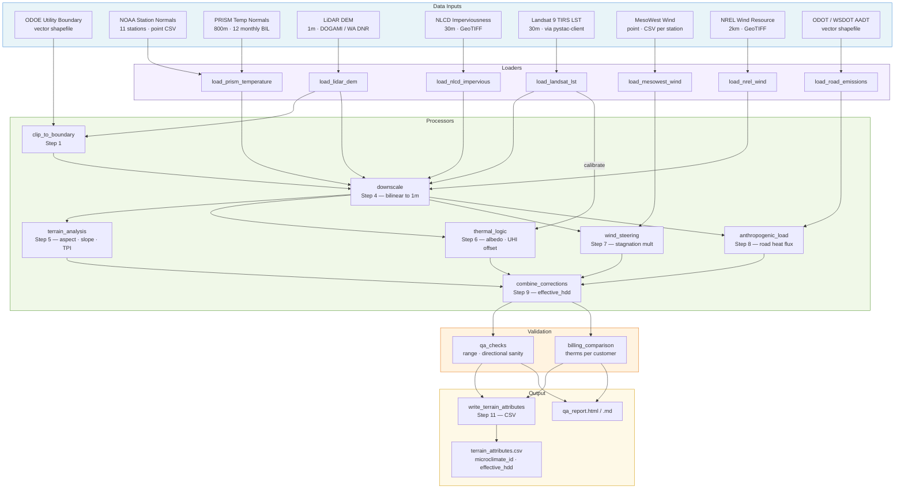

# Design — Regional Microclimate Modeling Engine

## Overview

The Regional Microclimate Modeling Engine is an 11-step Python pipeline that converts geographic regions in the regional utility service territory into a pre-computed microclimate lookup table (`terrain_attributes.csv`). The pipeline integrates five data layers — LiDAR terrain, PRISM temperature normals, NLCD imperviousness, MesoWest/NREL wind, and ODOT/WSDOT traffic — to produce an `effective_hdd` value for every planning district or Census block group.

**Inputs**: LiDAR DEM (1 m), PRISM monthly temperature normals (800 m), NLCD imperviousness (30 m), Landsat 9 LST (30 m), MesoWest wind observations (point), NREL wind resource (2 km), ODOT/WSDOT AADT shapefiles (vector), OR/WA state boundary polygon (vector).

**Output**: `terrain_attributes.csv` — one row per district/block group, all corrections pre-computed, joined to the simulation pipeline on `microclimate_id` and `district_code` at runtime. No raster sampling occurs during simulation runs.

**Relationship to parent model**: The End-Use Forecasting Model assigns every premise a base HDD from `DISTRICT_WEATHER_MAP`. This pipeline refines that base HDD into `effective_hdd` by applying terrain, surface, wind, and traffic corrections at sub-district scale. The simulation pipeline replaces `base_hdd` with `effective_hdd` when `terrain_attributes.csv` is present.

---

## Architecture

The pipeline is organized into 11 sequential steps, each corresponding to a processor module. Steps 5–8 are independent of each other and operate on the same downscaled raster stack produced by Step 4. Step 9 combines their outputs.

```
Step 1  → clip_to_boundary        (define region, mask to OR/WA state boundary)
Step 2  → config.DISTRICT_WEATHER_MAP  (district → base station lookup)
Step 3  → load_prism_temperature   (atmospheric base HDD grid)
Step 4  → downscale               (all rasters → 1m LiDAR grid)
Step 5  → terrain_analysis        (aspect, slope, TPI, wind shadow, lapse rate)
Step 6  → thermal_logic           (albedo, solar aspect, UHI offset, Landsat calibration)
Step 7  → wind_steering           (stagnation multiplier, infiltration multiplier)
Step 8  → anthropogenic_load      (road buffers, heat flux)
Step 9  → combine_corrections     (effective_hdd per grid cell)
Step 10 → weather adjustment      (optional: actual/normal HDD ratio)
Step 11 → write_terrain_attributes (aggregate to district, write CSV)
```

---

## Module Structure

```
src/
├── config.py                      # All constants, file paths, CRS settings
├── pipeline.py                    # Main orchestrator: run_region(region_name)
├── loaders/
│   ├── load_lidar_dem.py          # Load GeoTIFF, handle nodata, return (array, transform, crs)
│   ├── load_prism_temperature.py  # Load 12 monthly BIL files, compute annual HDD grid
│   ├── load_landsat_lst.py        # Load GeoTIFF, apply Collection 2 scale factor, return °C array
│   ├── load_mesowest_wind.py      # Load CSVs, aggregate to annual mean/p90 per station
│   ├── load_nrel_wind.py          # Load GeoTIFF, scale from 80m to 10m surface wind
│   ├── load_nlcd_impervious.py    # Load GeoTIFF, handle sentinel values
│   └── load_road_emissions.py     # Load shapefile, filter AADT > 0, compute heat flux per segment
├── processors/
│   ├── clip_to_boundary.py        # Clip all rasters to ODOE utility boundary polygon
│   ├── downscale.py               # Reproject all rasters to 1m LiDAR grid (bilinear)
│   ├── terrain_analysis.py        # Aspect, slope, TPI (annulus 300–1000m), wind shadow, lapse rate
│   ├── thermal_logic.py           # Surface albedo, solar aspect multiplier, UHI offset, Landsat calibration
│   ├── wind_steering.py           # TPI + wind speed → stagnation multiplier, infiltration multiplier
│   ├── anthropogenic_load.py      # Buffer roads by AADT, compute heat flux W/m², convert to temp offset
│   └── combine_corrections.py     # Combine all corrections into effective_hdd per grid cell
├── validation/
│   ├── qa_checks.py               # Range checks, directional sanity, flag implausible values
│   └── billing_comparison.py      # Compare effective_hdd against billing-derived therms per customer
└── output/
    └── write_terrain_attributes.py  # Aggregate 1m grid to district/block group, assign microclimate_id, write CSV
```

---

## Key Design Decisions

1. **Region-by-region processing**: The pipeline processes one region at a time (e.g., `portland_metro`, `the_dalles`) to keep memory usage manageable. A 1 m LiDAR DEM for the Portland Metro region is approximately 50–100 GB uncompressed; loading the full service territory simultaneously is not feasible.

2. **ODOE boundary as the authoritative mask**: All rasters are clipped to the ODOE Gas Utility boundary before any computation. This prevents edge effects from adjacent utility territories and ensures output rows correspond only to NW Natural premises.

3. **LiDAR DEM as the reference grid**: All other rasters are snapped to the LiDAR DEM's CRS, pixel size, and origin. This eliminates alignment errors that would arise from independent grid definitions. The target CRS is NAD83 / UTM Zone 10N (EPSG:26910) for all Oregon and most Washington districts.

4. **Bilinear interpolation for all downscaling**: Nearest-neighbor resampling is not used for any continuous-value raster (temperature, imperviousness, wind speed, LST). Bilinear interpolation preserves smooth gradients and avoids blocky artifacts when upscaling from 800 m or 30 m to 1 m.

5. **PRISM bias-corrected to NOAA station values**: PRISM provides spatial continuity; NOAA station normals provide calibration accuracy. The two are combined by computing an additive bias at each station location and interpolating it spatially across the grid. This ensures the pipeline output is consistent with the station-based HDD values used in the rest of the forecasting model.

6. **TPI annulus radius 300–1,000 m for valley/ridge classification**: This scale captures the terrain features that matter for cold air pooling and wind exposure (neighborhood-scale ridges and valleys) without being dominated by micro-topography (individual buildings, road cuts) or macro-topography (the Cascades vs. the valley floor).

7. **Prevailing wind direction 225° (SW) for windward/leeward classification**: The dominant wind direction across the NW Natural service territory is from the SW, driven by Pacific storm tracks. This constant is defined in `config.py` as `PREVAILING_WIND_DEG` and can be overridden per region for the Columbia Gorge (where east-west channeling dominates).

8. **`microclimate_id` format: `{region_code}_{district_code_IRP}_{base_station}`**: This format encodes the three levels of the geographic hierarchy in a single readable string. Example: `PDX_MULT_KPDX` = Portland Metro region, Multnomah County district, Portland airport station. The format is stable across pipeline re-runs as long as the region registry and district map do not change.

9. **`terrain_attributes.csv` as pre-computed lookup**: The simulation pipeline joins on `microclimate_id` at runtime. No raster files are opened during a simulation run. This decouples the computationally expensive microclimate pipeline (hours to run) from the simulation pipeline (seconds to run) and allows the CSV to be version-controlled and audited independently.

10. **`pystac-client` for Landsat 9 scene access via Microsoft Planetary Computer**: Rather than requiring manual download of Landsat 9 scenes from USGS EarthExplorer, the pipeline uses `pystac-client` to query the Microsoft Planetary Computer STAC catalog. This enables reproducible, automated access to cloud-hosted Landsat 9 Collection 2 Level-2 scenes filtered by date, cloud cover, and bounding box.

---

## Data Flow



---

## Output Schema

Full column definitions for `terrain_attributes.csv`. One row per IRP district or Census block group per pipeline run.

| Column | Type | Description |
|--------|------|-------------|
| `microclimate_id` | string | Unique identifier: `{region_code}_{district_code_IRP}_{base_station}` (e.g., `PDX_MULT_KPDX`) |
| `district_code_IRP` | string | NW Natural IRP district code (e.g., `MULT`, `LANE`, `SKAM`) — primary join key to premise-equipment table |
| `geo_id` | string | District code or Census block group GEOID |
| `region` | string | Processing region name (e.g., `portland_metro`, `the_dalles`, `coos_bay`) |
| `base_station` | string | NOAA weather station ICAO code (e.g., `KPDX`) |
| `terrain_position` | string | Dominant terrain position: `windward`, `leeward`, `valley`, or `ridge` |
| `mean_elevation_ft` | float64 | Mean elevation of the district/block group in feet above sea level |
| `dominant_aspect_deg` | float64 | Modal aspect direction in degrees (0–360°, clockwise from north) |
| `mean_wind_ms` | float64 | Mean annual surface wind speed (m/s) from MesoWest/NREL combined surface |
| `wind_infiltration_mult` | float64 | HDD multiplier from wind-driven envelope infiltration (1.0 = baseline at 3 m/s) |
| `prism_annual_hdd` | float64 | PRISM-derived annual HDD (°F-days, base 65°F), bias-corrected to NOAA station values |
| `lst_summer_c` | float64 | Mean summer land surface temperature from Landsat 9 TIRS (°C); null if Landsat unavailable |
| `mean_impervious_pct` | float64 | Mean NLCD 2021 impervious surface percentage (0–100) |
| `surface_albedo` | float64 | Computed surface albedo (0.05–0.20) from NLCD imperviousness |
| `uhi_offset_f` | float64 | UHI temperature offset (°F above rural baseline), wind-stagnation adjusted |
| `road_heat_flux_wm2` | float64 | Mean traffic waste heat flux within district (W/m²) |
| `road_temp_offset_f` | float64 | Temperature offset from road heat flux (°F) |
| `hdd_terrain_mult` | float64 | HDD multiplier from terrain position (windward/leeward/valley/ridge) |
| `hdd_elev_addition` | float64 | HDD addition from elevation lapse rate above base station (°F-days) |
| `hdd_uhi_reduction` | float64 | HDD reduction from UHI effect (positive value = reduction) |
| `effective_hdd` | float64 | Final adjusted annual HDD for simulation: `base_hdd × terrain_mult + elev_addition − uhi_reduction − traffic_reduction` |
| `run_date` | string | ISO 8601 timestamp of pipeline execution (e.g., `2025-01-15T14:32:00`) |
| `pipeline_version` | string | Semantic version of the pipeline (e.g., `1.0.0`) |
| `lidar_vintage` | int | Year of the LiDAR DEM used (e.g., `2021`) |
| `nlcd_vintage` | int | NLCD release year (e.g., `2021`) |
| `prism_period` | string | PRISM climate normal period (e.g., `1991-2020`) |

---

## Tech Stack

| Package | Version | Role |
|---------|---------|------|
| `rasterio` | ≥ 1.3 | GeoTIFF I/O, reprojection, raster sampling, bilinear resampling |
| `numpy` | ≥ 1.24 | Array math, gradient computation, masking, TPI annulus calculation |
| `geopandas` | ≥ 0.14 | Shapefile I/O, ODOE boundary clipping, road buffer geometry |
| `scipy` | ≥ 1.11 | Bilinear interpolation smoothing (`ndimage`), spatial bias correction |
| `pystac-client` | ≥ 0.7 | Landsat 9 scene discovery via Microsoft Planetary Computer STAC catalog |
| `pandas` | ≥ 2.0 | CSV I/O, terrain attributes table construction, QA report tabulation |
| `pyproj` | ≥ 3.6 | CRS transformations, UTM zone handling (Zone 10N / Zone 11N boundary) |
| `shapely` | ≥ 2.0 | Road buffer geometry (used via geopandas) |
| `richdem` | ≥ 0.3 | TPI computation and flow accumulation from DEM (optional; fallback to numpy gradient) |
| `requests` | ≥ 2.31 | NOAA CDO API calls for station normals download |
