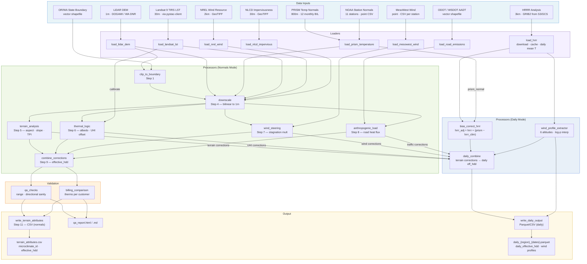

# Design — Regional Microclimate Modeling Engine

## Overview

The Regional Microclimate Modeling Engine is a Python pipeline that converts geographic regions in Oregon and Washington into high-resolution microclimate maps at the ZIP code level. The pipeline supports two operating modes:

- **Normals mode** (existing, 11-step): Integrates LiDAR terrain, PRISM temperature normals, NLCD imperviousness, MesoWest/NREL wind, and ODOT/WSDOT traffic to produce an annual `effective_hdd` value per ZIP code in `terrain_attributes.csv`.
- **Daily mode** (new): Uses HRRR 3 km hourly atmospheric data as the base (bias-corrected against PRISM climatology), applies the same terrain corrections, and additionally extracts multi-altitude GA wind profiles from HRRR pressure-level data. Produces daily `effective_hdd` and wind profiles per ZIP code in a time-series Parquet/CSV file.

**Inputs (normals mode)**: LiDAR DEM (1 m), PRISM monthly temperature normals (800 m), NLCD imperviousness (30 m), Landsat 9 LST (30 m), MesoWest wind observations (point), NREL wind resource (2 km), ODOT/WSDOT AADT shapefiles (vector), OR/WA state boundary polygon (vector).

**Inputs (daily mode, additional)**: HRRR 3 km GRIB2 analysis files from AWS S3 (`s3://noaa-hrrr-bdp-pds/`) or Google Cloud, providing hourly 2 m temperature, 10 m wind, and pressure-level wind fields at 22 levels (1000–500 mb).

**Output (normals mode)**: `terrain_attributes.csv` — one row per ZIP code/block group, all corrections pre-computed, joined to downstream models on `microclimate_id` and `zip_code` at runtime. No raster sampling occurs during downstream model runs.

**Output (daily mode)**: `daily_{region}_{start}_{end}.parquet` (or `.csv`) — one row per ZIP code per date, with daily `effective_hdd`, bias-corrected temperature, and wind speed/direction at six GA altitude levels (surface, 3k, 6k, 9k, 12k, 18k ft AGL).

**Relationship to downstream models**: Any forecasting or analysis model that uses a single airport-station HDD per geographic area can replace that base HDD with `effective_hdd` from this pipeline. The `ZIPCODE_STATION_MAP` in `config.py` maps each ZIP code to its nearest NOAA station; the pipeline refines that base HDD by applying terrain, surface, wind, and traffic corrections at sub-ZIP-code scale. Daily mode extends this to time-series analysis and short-range forecasting.

---

## Architecture

The pipeline is organized into 11 sequential steps for normals mode, each corresponding to a processor module. Steps 5–8 are independent of each other and operate on the same downscaled raster stack produced by Step 4. Step 9 combines their outputs. Daily mode adds a parallel path that branches after the terrain corrections are computed.

### Normals Mode Pipeline (existing)

```
Step 1  → clip_to_boundary        (define region, mask to OR/WA state boundary)
Step 2  → config.ZIPCODE_STATION_MAP  (ZIP code → base station lookup)
Step 3  → load_prism_temperature   (atmospheric base HDD grid)
Step 4  → downscale               (all rasters → 1m LiDAR grid)
Step 5  → terrain_analysis        (aspect, slope, TPI, wind shadow, lapse rate)
Step 6  → thermal_logic           (albedo, solar aspect, UHI offset, Landsat calibration)
Step 7  → wind_steering           (stagnation multiplier, infiltration multiplier)
Step 8  → anthropogenic_load      (road buffers, heat flux)
Step 9  → combine_corrections     (effective_hdd per grid cell)
Step 10 → weather adjustment      (optional: actual/normal HDD ratio)
Step 11 → write_terrain_attributes (aggregate to ZIP code, write CSV)
```

### Daily Mode Pipeline (new)

Daily mode reuses the terrain correction layers from Steps 5–8 (which are terrain/surface properties that don't change day-to-day) and replaces the PRISM atmospheric base with HRRR daily fields.

```
Step D1 → load_hrrr              (download/cache HRRR GRIB2 from S3, compute daily mean T)
Step D2 → bias_correct_hrrr      (hrrr_adjusted = hrrr_raw + (prism_normal − hrrr_climatology))
Step D3 → extract_wind_profiles  (interpolate pressure-level winds to 6 GA altitudes per ZIP)
Step D4 → daily_combine          (apply terrain corrections to bias-corrected HRRR → daily effective_hdd)
Step D5 → write_daily_output     (time-series Parquet/CSV: daily_effective_hdd + wind profiles per ZIP)
```

When `--mode both` is specified, the pipeline runs normals mode first (Steps 1–11), then daily mode (Steps D1–D5), reusing the terrain corrections already computed.

---

## Module Structure

```
src/
├── config.py                      # All constants, file paths, CRS settings
├── pipeline.py                    # Main orchestrator: run_region(region_name, mode)
├── loaders/
│   ├── load_lidar_dem.py          # Load GeoTIFF, handle nodata, return (array, transform, crs)
│   ├── load_prism_temperature.py  # Load 12 monthly BIL files, compute annual HDD grid
│   ├── load_hrrr.py               # Download/cache HRRR GRIB2 from S3/GCS, compute daily mean T
│   ├── load_landsat_lst.py        # Load GeoTIFF, apply Collection 2 scale factor, return °C array
│   ├── load_mesowest_wind.py      # Load CSVs, aggregate to annual mean/p90 per station
│   ├── load_nrel_wind.py          # Load GeoTIFF, scale from 80m to 10m surface wind
│   ├── load_nlcd_impervious.py    # Load GeoTIFF, handle sentinel values
│   └── load_road_emissions.py     # Load shapefile, filter AADT > 0, compute heat flux per segment
├── processors/
│   ├── clip_to_boundary.py        # Clip all rasters to OR/WA state boundary polygon
│   ├── downscale.py               # Reproject all rasters to 1m LiDAR grid (bilinear)
│   ├── terrain_analysis.py        # Aspect, slope, TPI (annulus 300–1000m), wind shadow, lapse rate
│   ├── thermal_logic.py           # Surface albedo, solar aspect multiplier, UHI offset, Landsat calibration
│   ├── wind_steering.py           # TPI + wind speed → stagnation multiplier, infiltration multiplier
│   ├── anthropogenic_load.py      # Buffer roads by AADT, compute heat flux W/m², convert to temp offset
│   ├── combine_corrections.py     # Combine all corrections into effective_hdd per grid cell
│   ├── bias_correct_hrrr.py       # Additive bias correction: hrrr_adjusted = hrrr_raw + (prism_normal − hrrr_climatology)
│   ├── wind_profile_extractor.py  # Extract multi-altitude wind from HRRR pressure levels → 6 GA altitudes
│   └── daily_combine.py           # Apply terrain corrections to HRRR daily base → daily effective_hdd
├── validation/
│   ├── qa_checks.py               # Range checks, directional sanity, flag implausible values
│   └── billing_comparison.py      # Compare effective_hdd against billing-derived therms per customer
└── output/
    ├── write_terrain_attributes.py  # Aggregate 1m grid to ZIP code/block group, assign microclimate_id, write CSV
    └── write_daily_output.py        # Write daily time-series Parquet/CSV with effective_hdd + wind profiles
```

---

## Key Design Decisions

1. **Region-by-region processing**: The pipeline processes one region at a time to keep memory usage manageable. A 1 m LiDAR DEM for a metro region is approximately 50–100 GB uncompressed; loading the full OR/WA extent simultaneously is not feasible.

2. **OR/WA state boundary as the authoritative mask**: All rasters are clipped to the Oregon/Washington state boundary before any computation. This prevents edge effects and ensures output rows correspond only to ZIP codes within the study area. An optional utility or custom boundary shapefile can be supplied via `BOUNDARY_SHP` in `config.py` to further restrict the processing extent.

3. **LiDAR DEM as the reference grid**: All other rasters are snapped to the LiDAR DEM's CRS, pixel size, and origin. This eliminates alignment errors that would arise from independent grid definitions. The target CRS is NAD83 / UTM Zone 10N (EPSG:26910) for all Oregon and most Washington districts.

4. **Bilinear interpolation for all downscaling**: Nearest-neighbor resampling is not used for any continuous-value raster (temperature, imperviousness, wind speed, LST). Bilinear interpolation preserves smooth gradients and avoids blocky artifacts when upscaling from 800 m or 30 m to 1 m.

5. **PRISM bias-corrected to NOAA station values**: PRISM provides spatial continuity; NOAA station normals provide calibration accuracy. The two are combined by computing an additive bias at each station location and interpolating it spatially across the grid. This ensures the pipeline output is consistent with the station-based HDD values used in the rest of the forecasting model.

6. **TPI annulus radius 300–1,000 m for valley/ridge classification**: This scale captures the terrain features that matter for cold air pooling and wind exposure (neighborhood-scale ridges and valleys) without being dominated by micro-topography (individual buildings, road cuts) or macro-topography (the Cascades vs. the valley floor).

7. **Prevailing wind direction 225° (SW) for windward/leeward classification**: The dominant wind direction across Oregon and Washington is from the SW, driven by Pacific storm tracks. This constant is defined in `config.py` as `PREVAILING_WIND_DEG` and can be overridden per region for the Columbia Gorge (where east-west channeling dominates).

8. **`microclimate_id` format: `{region_code}_{zip_code}_{base_station}`**: This format encodes the three levels of the geographic hierarchy in a single readable string. Example: `R1_97201_KPDX` = Region 1, ZIP code 97201, Portland airport station. The format is stable across pipeline re-runs as long as the region registry does not change.

9. **`terrain_attributes.csv` as pre-computed lookup**: Downstream models join on `microclimate_id` at runtime. No raster files are opened during a model run. This decouples the computationally expensive microclimate pipeline (hours to run) from downstream models (seconds to run) and allows the CSV to be version-controlled and audited independently.

10. **`pystac-client` for Landsat 9 scene access via Microsoft Planetary Computer**: Rather than requiring manual download of Landsat 9 scenes from USGS EarthExplorer, the pipeline uses `pystac-client` to query the Microsoft Planetary Computer STAC catalog. This enables reproducible, automated access to cloud-hosted Landsat 9 Collection 2 Level-2 scenes filtered by date, cloud cover, and bounding box.

11. **HRRR as the daily-mode atmospheric base**: HRRR provides 3 km hourly atmospheric fields across CONUS, available from ~2014 to present. For daily mode, HRRR replaces PRISM as the atmospheric base because PRISM only provides 30-year normals (no daily fields). HRRR is bias-corrected against PRISM climatology using an additive offset (`hrrr_adjusted = hrrr_raw + (prism_normal − hrrr_climatology)`) so that the two sources are consistent and HRRR inherits PRISM's terrain-aware station calibration.

12. **Additive bias correction for HRRR–PRISM consistency**: The bias correction is additive rather than multiplicative because temperature offsets (in °F or °C) are more physically meaningful than ratios for near-surface temperature fields. The HRRR climatology is computed from all available HRRR years in the local cache for the target month (minimum 3 years required). If fewer than 3 years are cached, the pipeline falls back to using the raw HRRR monthly mean as the climatology reference.

13. **Log-pressure interpolation for altitude wind profiles**: HRRR provides wind fields at discrete pressure levels (925, 850, 700, 500 mb, etc.). To extract wind at the six target GA altitudes (3k, 6k, 9k, 12k, 15k, 18k ft AGL), the pipeline interpolates U and V wind components linearly in log-pressure space, then computes speed and direction from the interpolated components. Pressure-to-altitude conversion uses the hypsometric equation with HRRR surface pressure and 2 m temperature rather than fixed lookup tables, which accounts for day-to-day atmospheric density variations.

14. **HRRR data cached locally in `data/hrrr/`**: HRRR GRIB2 files are ~50–100 MB each (24 files per day = ~1.2–2.4 GB/day). The loader caches downloaded files in `data/hrrr/` organized by date, and skips re-downloading files that already exist. A manifest CSV tracks download status. The pipeline prompts for confirmation if the estimated download exceeds 10 GB unless `--no-confirm` is specified.

15. **Parquet as default daily output format**: Daily mode produces one row per ZIP code per date, which can be millions of rows for a month-long run across all OR/WA ZIP codes. Parquet provides columnar compression (typically 5–10× smaller than CSV), fast column-selective reads, and native support in pandas and downstream analytics tools. CSV output is available via `--output-format csv` for compatibility.

16. **Terrain corrections shared between modes**: The terrain correction layers (TPI, UHI, wind stagnation, traffic heat) are properties of the land surface and built environment, not the atmosphere. They change on the timescale of years (new development, wildfire), not days. Both normals and daily mode apply the same correction formulas and constants, so the terrain correction arrays computed in normals mode can be reused directly in daily mode when `--mode both` is specified.

17. **Altitude-level microclimates use only bias-corrected temperature, no surface corrections**: At 3,000 ft and above, surface-specific corrections (UHI, traffic heat, imperviousness-driven albedo) have no physical relevance — a pilot at 9,000 ft is not affected by road heat flux. Altitude-level HDD is computed as `max(0, 65 − temp_alt_adjusted_f)` using only the HRRR pressure-level temperature bias-corrected with the surface-level PRISM offset. The surface PRISM bias is propagated upward because altitude-specific PRISM data does not exist, but the bias is primarily a systematic model offset that applies across the lower troposphere.

18. **NLCD-derived surface property mask for boundary layer modification (0–1,000 ft AGL)**: The lowest 1,000 ft of the atmosphere is strongly influenced by the surface beneath it. HRRR's 3 km grid smooths over roughness transitions (forest edges, urban-rural boundaries, water bodies) that create localized wind shear and thermal effects at scales relevant to GA and drone operations. The pipeline constructs a surface property mask from NLCD 2021 land cover, mapping each pixel to roughness length (z₀), albedo, and emissivity. At roughness transition zones (where Δz₀ exceeds a threshold), a log-law wind shear correction adjusts boundary-layer winds. Over water bodies, a thermal subsidence correction reduces boundary-layer temperature using an exponential decay with height (`H_bl = 500 ft`). These corrections apply only at altitudes ≤ 1,000 ft AGL — above that, the standard HRRR pressure-level interpolation is used unchanged.

19. **Aviation Safety Cube as a 3D output structure**: The daily output is extended from a flat table (ZIP × date) to a 3D cube (ZIP × date × altitude) with 8 altitude levels: surface, 500 ft, 1,000 ft, 3,000 ft, 6,000 ft, 9,000 ft, 12,000 ft, and 18,000 ft AGL. The two new sub-1,000 ft levels (500 ft and 1,000 ft) provide finer resolution in the boundary layer where surface physics effects are strongest. Each cell in the cube contains temperature, wind, TKE, wind shear, HDD, and density altitude — everything a pilot or UAS operator needs to assess conditions at a specific altitude. The cube is stored as a Parquet file partitioned by date for efficient time-range queries.

20. **Displaced log-law wind profile for forested terrain**: Over forests (NLCD 41–43), the effective ground level for the wind profile is shifted upward by the displacement height `d` (15–18 m for PNW conifers). The wind profile becomes `u(z) = (u_star / κ) × ln((z − d) / z₀)`, which produces a significant wind speed deficit in the lowest 50–100 ft above the canopy. This is critical for GA operations near forested ridges and valleys where HRRR's 3 km grid cannot resolve the canopy effect. Below the displacement height, wind speed is set to zero (within-canopy).

21. **TKE as a turbulence proxy for urban areas**: Developed areas (NLCD 22–24) generate mechanical turbulence from building-induced flow separation. The pipeline computes TKE as `0.5 × u_star² × (1 + 2 × (z0_urban / z0_rural))`, which scales with both wind speed and the roughness contrast between urban and rural surfaces. TKE is reported in m²/s² and mapped to standard aviation turbulence categories (smooth/light/moderate/severe) for pilot-friendly interpretation.

22. **Real-time daemon with static feature cache (optional)**: The batch pipeline (Tasks 1–11) processes historical date ranges. The real-time daemon extends this to near-real-time by polling for new HRRR cycles via the `herbie` library and processing each through a streaming pipeline that reuses a pre-computed static cache of all non-temporal features (NLCD surface mask, LiDAR terrain, road heat flux, UHI offsets). The static cache is built once and loaded into memory at daemon startup, so each hourly cycle only needs to download one HRRR GRIB2 file (~100 MB), downscale it, apply the cached modifiers, and write the safety cube — targeting < 120 seconds per cycle. The poller runs in a separate `multiprocessing.Process` to keep network I/O from blocking the compute path.

---

## Data Flow



---

## Output Schema

Full column definitions for `terrain_attributes.csv`. One row per ZIP code or Census block group per pipeline run.

| Column | Type | Description |
|--------|------|-------------|
| `microclimate_id` | string | Unique identifier: `{region_code}_{zip_code}_{base_station}` (e.g., `R1_97201_KPDX`) |
| `zip_code` | string | US ZIP code — primary geographic key for joins to external datasets |
| `geo_id` | string | ZIP code or Census block group GEOID |
| `region` | string | Processing region name (e.g., `region_1`) |
| `base_station` | string | NOAA weather station ICAO code (e.g., `KPDX`) |
| `terrain_position` | string | Dominant terrain position: `windward`, `leeward`, `valley`, or `ridge` |
| `mean_elevation_ft` | float64 | Mean elevation of the ZIP code/block group in feet above sea level |
| `dominant_aspect_deg` | float64 | Modal aspect direction in degrees (0–360°, clockwise from north) |
| `mean_wind_ms` | float64 | Mean annual surface wind speed (m/s) from MesoWest/NREL combined surface |
| `wind_infiltration_mult` | float64 | HDD multiplier from wind-driven envelope infiltration (1.0 = baseline at 3 m/s) |
| `prism_annual_hdd` | float64 | PRISM-derived annual HDD (°F-days, base 65°F), bias-corrected to NOAA station values |
| `lst_summer_c` | float64 | Mean summer land surface temperature from Landsat 9 TIRS (°C); null if Landsat unavailable |
| `mean_impervious_pct` | float64 | Mean NLCD 2021 impervious surface percentage (0–100) |
| `surface_albedo` | float64 | Computed surface albedo (0.05–0.20) from NLCD imperviousness |
| `uhi_offset_f` | float64 | UHI temperature offset (°F above rural baseline), wind-stagnation adjusted |
| `road_heat_flux_wm2` | float64 | Mean traffic waste heat flux within ZIP code (W/m²) |
| `road_temp_offset_f` | float64 | Temperature offset from road heat flux (°F) |
| `hdd_terrain_mult` | float64 | HDD multiplier from terrain position (windward/leeward/valley/ridge) |
| `hdd_elev_addition` | float64 | HDD addition from elevation lapse rate above base station (°F-days) |
| `hdd_uhi_reduction` | float64 | HDD reduction from UHI effect (positive value = reduction) |
| `effective_hdd` | float64 | Final adjusted annual HDD for simulation: `base_hdd × terrain_mult + elev_addition − uhi_reduction − traffic_reduction` |
| `run_date` | string | ISO 8601 timestamp of pipeline execution (e.g., `2025-01-15T14:32:00`) |
| `pipeline_version` | string | Semantic version of the pipeline (e.g., `1.0.0`) |
| `lidar_vintage` | int | Year of the LiDAR DEM used (e.g., `2021`) |
| `nlcd_vintage` | int | NLCD release year (e.g., `2021`) |
| `prism_period` | string | PRISM climate normal period (e.g., `1991-2020`) |

---

## Daily Output Schema

Full column definitions for the daily mode output file (`daily_{region}_{start}_{end}.parquet` or `.csv`). One row per ZIP code per date.

| Column | Type | Description |
|--------|------|-------------|
| `date` | string | ISO 8601 date (e.g., `2024-01-15`) |
| `zip_code` | string | US ZIP code — primary geographic key |
| `microclimate_id` | string | Unique identifier: `{region_code}_{zip_code}_{base_station}` |
| `hrrr_raw_temp_f` | float64 | HRRR daily mean 2 m temperature (°F) before bias correction |
| `hrrr_adjusted_temp_f` | float64 | Bias-corrected HRRR daily mean temperature (°F) |
| `bias_correction_f` | float64 | Additive bias correction applied: `prism_normal − hrrr_climatology` (°F) |
| `daily_effective_hdd` | float64 | Daily effective HDD: `max(0, 65 − hrrr_adjusted_temp_f) × terrain_mult + elev_add − uhi_red − traffic_red` |
| `terrain_multiplier` | float64 | TPI-based terrain position multiplier (from normals mode terrain analysis) |
| `wind_speed_sfc_kt` | float64 | Surface (10 m AGL) wind speed (knots), daily mean |
| `wind_dir_sfc_deg` | float64 | Surface (10 m AGL) wind direction (degrees true), daily mean |
| `wind_speed_3000ft_kt` | float64 | Wind speed at 3,000 ft AGL (knots), daily mean |
| `wind_dir_3000ft_deg` | float64 | Wind direction at 3,000 ft AGL (degrees true), daily mean |
| `wind_speed_6000ft_kt` | float64 | Wind speed at 6,000 ft AGL (knots), daily mean |
| `wind_dir_6000ft_deg` | float64 | Wind direction at 6,000 ft AGL (degrees true), daily mean |
| `wind_speed_9000ft_kt` | float64 | Wind speed at 9,000 ft AGL (knots), daily mean |
| `wind_dir_9000ft_deg` | float64 | Wind direction at 9,000 ft AGL (degrees true), daily mean |
| `wind_speed_12000ft_kt` | float64 | Wind speed at 12,000 ft AGL (knots), daily mean |
| `wind_dir_12000ft_deg` | float64 | Wind direction at 12,000 ft AGL (degrees true), daily mean |
| `wind_speed_18000ft_kt` | float64 | Wind speed at 18,000 ft AGL (knots), daily mean |
| `wind_dir_18000ft_deg` | float64 | Wind direction at 18,000 ft AGL (degrees true), daily mean |
| `wind_max_sfc_kt` | float64 | Surface wind speed daily maximum (knots) |
| `wind_max_3000ft_kt` | float64 | Wind speed at 3,000 ft AGL daily maximum (knots) |
| `wind_max_6000ft_kt` | float64 | Wind speed at 6,000 ft AGL daily maximum (knots) |
| `wind_max_9000ft_kt` | float64 | Wind speed at 9,000 ft AGL daily maximum (knots) |
| `wind_max_12000ft_kt` | float64 | Wind speed at 12,000 ft AGL daily maximum (knots) |
| `wind_max_18000ft_kt` | float64 | Wind speed at 18,000 ft AGL daily maximum (knots) |
| `temp_sfc_raw_f` | float64 | HRRR surface (2 m) temperature before bias correction (°F) |
| `temp_sfc_adjusted_f` | float64 | Bias-corrected surface temperature (°F) — same as `hrrr_adjusted_temp_f` |
| `hdd_sfc` | float64 | Surface-level daily HDD (with full terrain corrections) — same as `daily_effective_hdd` |
| `temp_3000ft_raw_f` | float64 | HRRR temperature at 3,000 ft AGL before bias correction (°F) |
| `temp_3000ft_adjusted_f` | float64 | Bias-corrected temperature at 3,000 ft AGL (°F) |
| `hdd_3000ft` | float64 | HDD at 3,000 ft AGL: `max(0, 65 − temp_3000ft_adjusted_f)` — no surface corrections |
| `temp_6000ft_raw_f` | float64 | HRRR temperature at 6,000 ft AGL before bias correction (°F) |
| `temp_6000ft_adjusted_f` | float64 | Bias-corrected temperature at 6,000 ft AGL (°F) |
| `hdd_6000ft` | float64 | HDD at 6,000 ft AGL: `max(0, 65 − temp_6000ft_adjusted_f)` — no surface corrections |
| `temp_9000ft_raw_f` | float64 | HRRR temperature at 9,000 ft AGL before bias correction (°F) |
| `temp_9000ft_adjusted_f` | float64 | Bias-corrected temperature at 9,000 ft AGL (°F) |
| `hdd_9000ft` | float64 | HDD at 9,000 ft AGL: `max(0, 65 − temp_9000ft_adjusted_f)` — no surface corrections |
| `temp_12000ft_raw_f` | float64 | HRRR temperature at 12,000 ft AGL before bias correction (°F) |
| `temp_12000ft_adjusted_f` | float64 | Bias-corrected temperature at 12,000 ft AGL (°F) |
| `hdd_12000ft` | float64 | HDD at 12,000 ft AGL: `max(0, 65 − temp_12000ft_adjusted_f)` — no surface corrections |
| `temp_18000ft_raw_f` | float64 | HRRR temperature at 18,000 ft AGL before bias correction (°F) |
| `temp_18000ft_adjusted_f` | float64 | Bias-corrected temperature at 18,000 ft AGL (°F) |
| `hdd_18000ft` | float64 | HDD at 18,000 ft AGL: `max(0, 65 − temp_18000ft_adjusted_f)` — no surface corrections |
| `z0_m` | float64 | Area-weighted mean roughness length (m) within ZIP code from NLCD surface mask |
| `albedo` | float64 | Area-weighted mean surface albedo within ZIP code from NLCD surface mask |
| `emissivity` | float64 | Area-weighted mean surface emissivity within ZIP code from NLCD surface mask |
| `nlcd_dominant_class` | int | Most common NLCD land cover class within ZIP code |
| `roughness_transition_pct` | float64 | Fraction of ZIP code area in roughness transition zones (0–1) |
| `wind_shear_correction_sfc_kt` | float64 | Wind shear correction applied at surface due to roughness transitions (knots); 0 if no transitions |
| `water_cooling_sfc_f` | float64 | Thermal subsidence cooling applied at surface over water bodies (°F); 0 if no water |
| `run_date` | string | ISO 8601 timestamp of pipeline execution |
| `pipeline_version` | string | Semantic version of the pipeline |

---

## Tech Stack

| Package | Version | Role |
|---------|---------|------|
| `rasterio` | ≥ 1.3 | GeoTIFF I/O, reprojection, raster sampling, bilinear resampling |
| `numpy` | ≥ 1.24 | Array math, gradient computation, masking, TPI annulus calculation |
| `geopandas` | ≥ 0.14 | Shapefile I/O, boundary clipping, road buffer geometry |
| `scipy` | ≥ 1.11 | Bilinear interpolation smoothing (`ndimage`), spatial bias correction |
| `pystac-client` | ≥ 0.7 | Landsat 9 scene discovery via Microsoft Planetary Computer STAC catalog |
| `pandas` | ≥ 2.0 | CSV I/O, terrain attributes table construction, QA report tabulation |
| `pyproj` | ≥ 3.6 | CRS transformations, UTM zone handling (Zone 10N / Zone 11N boundary) |
| `shapely` | ≥ 2.0 | Road buffer geometry (used via geopandas) |
| `richdem` | ≥ 0.3 | TPI computation and flow accumulation from DEM (optional; fallback to numpy gradient) |
| `requests` | ≥ 2.31 | NOAA CDO API calls for station normals download |
| `xarray` | ≥ 2023.1 | N-dimensional labeled array operations; reads HRRR GRIB2 via cfgrib engine; daily mean aggregation |
| `cfgrib` | ≥ 0.9.10 | xarray backend engine for reading GRIB2 files (`xarray.open_dataset(path, engine="cfgrib")`) |
| `eccodes` | ≥ 1.5 | ECMWF GRIB codec library; required C dependency for cfgrib |
| `s3fs` | ≥ 2023.1 | S3-compatible filesystem interface for anonymous access to `s3://noaa-hrrr-bdp-pds/` |
| `pyarrow` | ≥ 14.0 | Parquet I/O for daily mode time-series output (columnar compression, fast reads) |
